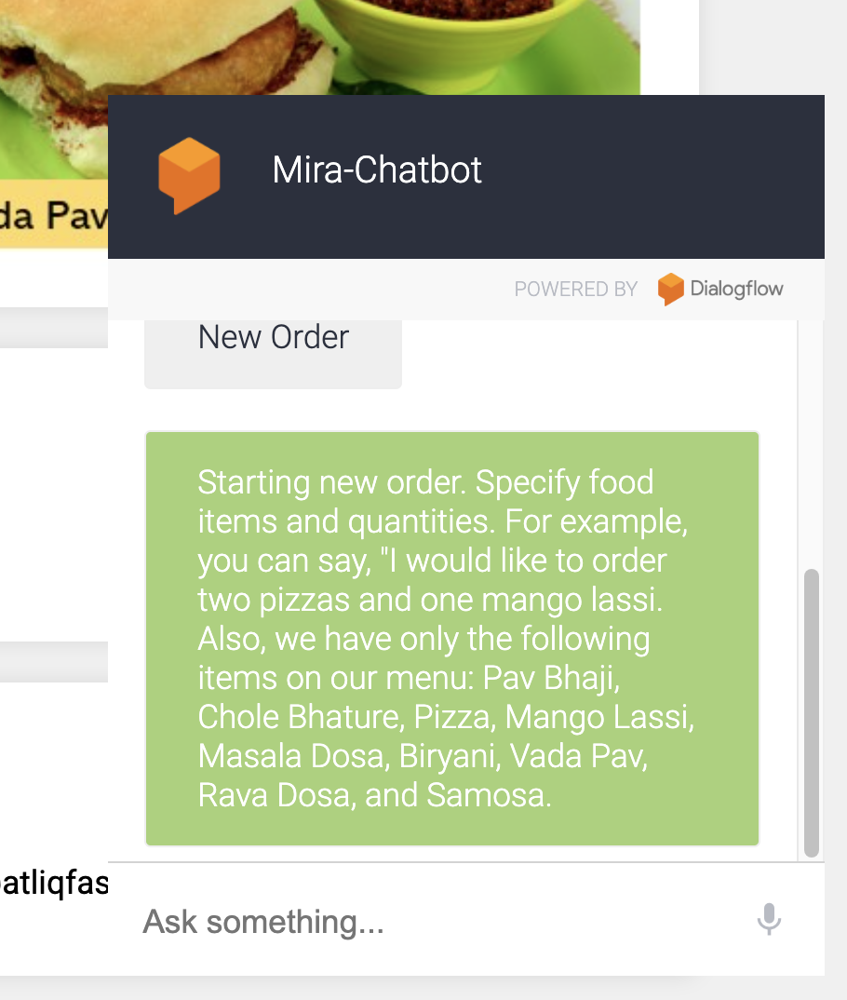

# NaysaChatBot
[Check out my Project](https://github.com/ayesha19765/Smart-Chatbot-Integration-for-Enhanced-Food-Ordering-Experience)

## Project Description:

### Overview:
NaysaChatBot is an intelligent and interactive chatbot system designed to revolutionize the food ordering experience. The chatbot provides users with a seamless and personalized platform to place, modify, and track their food orders, enhancing overall customer satisfaction. Built with cutting-edge technologies, NaysaChatBot automates order processing while providing real-time updates and data-driven insights.

---

## Features:

### **Enhanced Customer Engagement:**
- Interactive, human-like conversations that make food ordering simple and enjoyable.
- Personalized recommendations based on user preferences and past orders.

### **Streamlined Ordering Process:**
- Modify orders and view order summaries effortlessly.
- Complete transactions through intuitive chatbot interactions.

### **Real-Time Order Tracking:**
- Track orders in real-time with accurate status updates and estimated delivery times.
- Boosts transparency and reliability.

### **Operational Efficiency:**
- Automates order processing, reducing staff workload.
- Allows staff to focus on food preparation and customer service.

### **Data-Driven Insights:**
- Collects and analyzes customer preferences and ordering behaviors.
- Enables businesses to optimize menu offerings and strategies.

### **Scalability:**
- Flexible architecture for future enhancements and expanded capabilities.
- Easily adaptable to industry trends and customer feedback.


---

## Technology Stack:
- **Chatbot Platform:** DialogFlow
- **Back-end:** FastAPI, Python
- **Database:** MySQL
- **Integration:** RESTful APIs

---

## Local Setup:

### **To Set Up Locally:**
1. Clone the repository:
   ```bash
   git clone https://github.com/ayesha19765/Smart-Chatbot-Integration-for-Enhanced-Food-Ordering-Experience.git
   ```
2. Navigate to the project directory:
   ```bash
   cd Smart-Chatbot-Integration-for-Enhanced-Food-Ordering-Experience
   ```
3. Install dependencies:
   ```bash
   pip install -r requirements.txt
   ```
4. Start the chatbot server:
   ```bash
   uvicorn main:app --reload
   ```
   Open [http://localhost:8000](http://localhost:8000) in your browser to interact with the chatbot.

---

## How to Use:
1. Open the chatbot interface on the website or app.
2. Start a conversation by typing or selecting predefined queries.
3. Place your food order by following the chatbot prompts.
4. Modify or review your order before confirmation.
5. Track your order in real-time and enjoy your meal!

---

## Contributors:
- **Ayesha**

---

## Benefits:

### 1. Enhanced Customer Engagement:
- Interactive platform mimicking human-like conversations.
- Personalized user experiences.

### 2. Streamlined Ordering Process:
- Simplified and intuitive order placement.
- Efficient and user-friendly interface.

### 3. Real-Time Order Tracking:
- Keeps customers informed with accurate updates.
- Builds trust and reliability.

### 4. Operational Efficiency:
- Automation reduces manual workload.
- Optimized staff productivity and customer service.

### 5. Data-Driven Insights:
- Helps businesses analyze trends and improve offerings.
- Informs strategies to meet customer demands effectively.

### 6. Scalability:
- Flexible and adaptable to future requirements.
- Capable of handling increased user interactions.

---
## Screenshots





---

## Conclusion:
The successful integration of NaysaChatBot into Fresh and Delicious Foods' system represents a significant leap in enhancing the food ordering experience. By automating processes and focusing on customer-centric solutions, NaysaChatBot sets a new standard in digital food ordering. Continuous optimization and refinement will ensure its relevance in the dynamic food industry landscape.

Feel free to contribute, raise issues, or provide feedback to improve the NaysaChatBot. Together, let’s redefine the future of digital food ordering!

---

**Made With Love 🧡**

©2024 Ayesha. All rights reserved.

